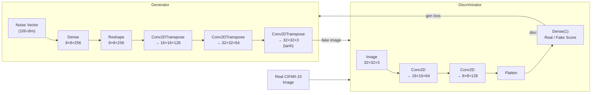

# GAN Image Generation: MNIST → CIFAR-10

**Extending a Generative Adversarial Network from grayscale digit generation to full-color object synthesis, demonstrating adversarial training dynamics across two datasets.**

---

## The "Why"

GANs are notoriously difficult to train — the generator and discriminator must improve together without either dominating the other. This project takes a course-provided MNIST baseline and extends it to a significantly harder problem: generating 32×32 **color** images from the CIFAR-10 dataset. The goal was to understand what architectural changes are necessary when moving from a simple single-channel grayscale task to a complex three-channel RGB one, and to observe how loss dynamics evolve over 50 epochs of training.

---

## Tech Stack

| Category | Technology | Why |
| :--- | :--- | :--- |
| **ML Framework** | TensorFlow 2.x / Keras | Industry-standard deep learning library with `@tf.function` JIT compilation for fast training loops |
| **Architecture** | Conv2DTranspose, Conv2D | Transposed convolutions for upsampling in the generator; standard convolutions for feature extraction in the discriminator |
| **Datasets** | MNIST, CIFAR-10 | MNIST (28×28 grayscale) as baseline; CIFAR-10 (32×32 RGB) as the extended challenge |
| **Visualization** | Matplotlib | Generating 4×4 image grids at training checkpoints to visually track GAN progress |
| **Optimization** | Adam (lr=1e-4) | Separate optimizers for generator and discriminator to maintain independent gradient updates |

---

## Key Features

- **Dual-network adversarial training** — Generator and discriminator are trained simultaneously using separate `GradientTape` contexts, ensuring gradients do not bleed across networks.

- **Architecture adapted for RGB output** — Generator starts from an 8×8×256 tensor (vs. 7×7 in the MNIST baseline) and upsamples via two `Conv2DTranspose` layers to reach 32×32×3. The final layer uses `tanh` activation to output values in `[-1, 1]`, matching the normalization of CIFAR-10 inputs.

- **Static noise seed for progress tracking** — A fixed 16-sample noise vector is used at every checkpoint to generate comparison images, making it possible to directly observe how the generator improves over training rather than seeing random snapshots.

- **Memory-optimized batch size** — Batch size reduced from 256 → 64 to fit within local hardware constraints while training on CIFAR-10's larger 32×32×3 images.

- **Structured training observability** — Live console progress (epoch %, generator loss, discriminator loss) with image checkpoints saved every 10 epochs and a Markdown-formatted summary table printed at the end of training.

---

## Architecture



**Training loop (minimax game):**
1. Generator creates fake images from random noise
2. Discriminator scores both real and fake images
3. Binary cross-entropy loss is computed for each network
4. Gradients are applied independently — discriminator learns to distinguish, generator learns to fool

---

## Results

| Epochs | Avg Generator Loss | Avg Discriminator Loss | Avg Time/Epoch |
| :---: | :---: | :---: | :---: |
| 1–10 | 1.4007 | 0.9599 | 513s |
| 11–20 | 0.8861 | 1.3160 | 462s |
| 21–30 | 0.8985 | 1.3262 | 430s |
| 31–40 | 0.8745 | 1.2540 | 435s |
| 41–50 | 0.9415 | 1.1999 | 428s |

Starting around **epoch 6**, the discriminator loss rises above the generator loss — a sign that generated images became harder to classify as fake, indicating the generator was learning meaningful structure.

### Generated Image Progression (CIFAR-10)

| Epoch 10 | Epoch 20 | Epoch 30 | Epoch 40 | Epoch 50 |
| :---: | :---: | :---: | :---: | :---: |
|  |  |  |  |  |

### MNIST Baseline (10 epochs)


---

## Challenges & Solutions

### Adapting the Generator for 32×32 RGB Output

**The problem:** The original MNIST generator starts from a 7×7 spatial tensor and upsamples twice to 28×28 using strides of `(1,1)` then `(2,2)`. Naively applying the same upsample schedule to CIFAR-10 (which needs 32×32 output) produces incorrect output dimensions.

**The solution:** Changed the initial reshape target to **8×8** (instead of 7×7). From there, two `Conv2DTranspose` layers with `strides=(2,2)` each double the spatial dimensions: 8×8 → 16×16 → 32×32. The final layer uses `strides=(1,1)` to maintain resolution while producing the 3-channel output. This required recalculating the Dense layer's output size to `8 × 8 × 256 = 16,384`.

**The insight:** GAN generator design requires working backwards from the target output shape. Each transposed convolution with stride 2 doubles spatial dimensions, so the starting shape must be `target_size / (2 ^ num_upsample_layers)`.

### Training Stability and Loss Interpretation

**The problem:** Raw loss values are misleading in GAN training — a low generator loss early in training may mean the discriminator is weak, not that the generator is good.

**The solution:** Used the loss *relationship* as the signal. When discriminator loss > generator loss, the generator is winning the adversarial game — the generated images are harder to identify as fake. This crossover, observed around epoch 6 in the CIFAR-10 run, was a more meaningful training signal than absolute loss values alone.

---

## Setup & Usage

**Requirements:** Python 3.8+, TensorFlow 2.x, Matplotlib

```bash
pip install tensorflow matplotlib
```

**Run the modified CIFAR-10 implementation:**
```bash
python implementation_mod.py
```

**Run the original MNIST baseline:**
```bash
python implementation_original.py
```

Generated images are saved as `image_at_epoch_XXXX.png` every 10 epochs. A Markdown-formatted training summary table is printed to stdout at the end of training.

---

*Course: CS552 — Generative Adversarial Networks, taught by Dr. Narahara Chari Dingar*
