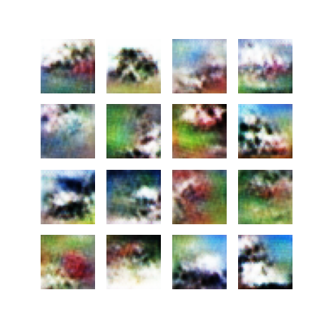
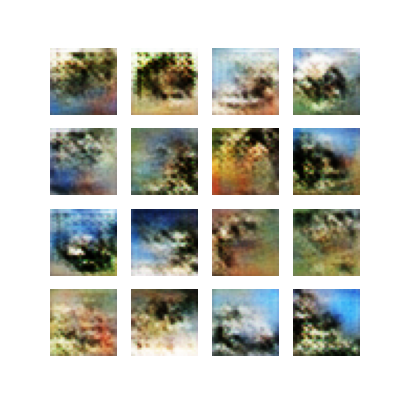
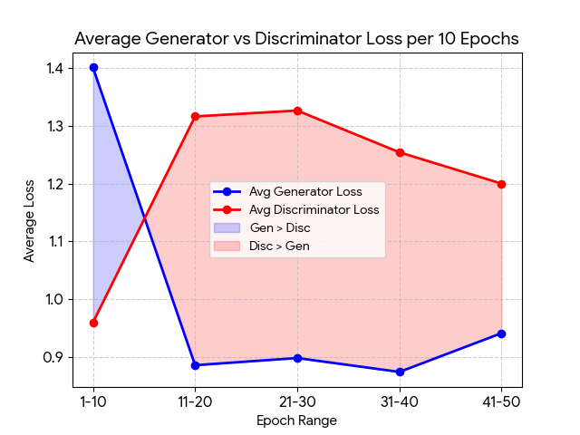

## Model Generation and Training
I included results for the modified code for MNIST dataset and the CIFAR10 dataset.
### Key Code Changes
The following changes were made to the provided starter code to include additional convolutional layers in the generator and implement image saving after every 10 layers.
1. Memory Usage: reduced batch size to 64 to speed up training and reduce memory usage. This change was implemented due to computational limits of the machine.
2. Progress Tracking: added print statements into the console to keep track of each training epoch in % and record the losses with the training time.
3. Consistency: set a seed variable to introduce the noise to get a better picture of how the model is improving over time.
4. Libraries: included matplotlib and time to draw/save images and track processing time
5. Generator: the generation uses deconvolution to reshape small flat images into 3D structures. In the subsequent layers, the strides doubles the height/width while reducing the depth.
6. Discriminator: Conv2D allows to detect edges in the MNIST dataset.
7. Image Processing: images saved after every 10 epochs to track algorithm process. Includes normalization reversal for more accurate plotting
8. Output: included .md format for the table containing training information.

### Training and Evaluation
#### MNIST dataset - baseline 10 epochs
All the averages were calculated based on the 10 epochs. 
- Generator Loss is 1.02
- Discriminator Loss is 1.15
- Training Time 355 seconds.

More detailed training metrics are provided below.
Below is the modified generator model used on the MNIST dataset over the first 10 epochs.

| Epoch Number | Generator Loss | Discriminator Loss | Training Time (seconds) |
|:------------:|:--------------:|:------------------:|:-----------------------:|
|      1       |      0.9       |        1.17        |           320           |
|      2       |      0.88      |        1.15        |           300           |
|      3       |      0.99      |        1.13        |           298           |
|      4       |      0.91      |        1.22        |           288           |
|      5       |      1.14      |        1.05        |           344           |
|      6       |      0.82      |        1.26        |           359           |
|      7       |    **1.26**    |        1.04        |           436           |
|      8       |      1.25      |        0.96        |         **455**         |
|      9       |      0.98      |        1.24        |           406           |
|      10      |      1.08      |        1.24        |           348           |

Based on the first 10 epochs, the following image was generated

Some of the numbers are a lot more recognizable than others but overall, the images seem to resemble
some sort of human handwriting.

#### CIFAR10 dataset
All of the averages are calculated based on the 10 epochs with the images included. The detailed metrics are provided at the end of the document.

| Epochs  | Generator Loss | Discriminator Loss | Training Time (seconds) | Image |
|:-------:|:--------------:|:------------------:|:-----------------------:| :-----------------------:|
| 1 - 10  |       1.4007       |         0.9599         |           513.06            | 
| 11 - 20 |       0.8861       |         1.3160        |           461.91            | 
| 21 - 30 |       0.8985       |         1.3262        |          430.44            | 
| 31 - 40 |       0.8745       |         1.2540         |          435.16            | 
| 41 - 50 |       0.9415       |         1.1999         |           427.96            | 

Below is the detailed description of each epoch metrics.

| Epoch Number | Generator Loss | Discriminator Loss | Training Time (s) |
|:------------:|:--------------:|:------------------:|:-----------------:|
|      1       |     3.2840     |       0.1381       |      554.30       |
|      2       |     1.2244     |       0.8274       |      555.40       |
|      3       |     1.3500     |       0.8751       |      512.09       |
|      4       |     2.0358     |       0.8199       |      541.36       |
|      5       |     1.0576     |       1.0265       |      475.52       |
|      6       |     1.1470     |       1.0599       |      503.55       |
|      7       |     0.9604     |       1.1554       |      514.16       |
|      8       |     0.8518     |       1.1689       |      480.75       |
|      9       |     1.3717     |       1.2203       |      480.44       |
|      10      |     0.7242     |       1.3077       |      513.07       |
|      11      |     0.7294     |       1.5046       |      544.36       |
|      12      |     1.1307     |       0.9717       |      536.78       |
|      13      |     1.1268     |       0.8175       |      503.79       |
|      14      |     0.7024     |       1.3721       |      450.15       |
|      15      |     0.4628     |       2.3419       |      429.84       |
|      16      |     1.1384     |       1.0297       |      437.95       |
|      17      |     0.8839     |       1.1784       |      428.82       |
|      18      |     0.7601     |       1.4105       |      425.30       |
|      19      |     0.9135     |       1.2662       |      433.58       |
|      20      |     1.0125     |       1.2675       |      428.53       |
|      21      |     1.1193     |       1.4339       |      438.42       |
|      22      |     1.0744     |       1.1541       |      439.86       |
|      23      |     0.8936     |       1.1270       |      440.06       |
|      24      |     0.8641     |       1.3877       |      423.87       |
|      25      |     0.8120     |       1.2815       |      421.84       |
|      26      |     0.9315     |       1.2854       |      438.23       |
|      27      |     0.8088     |       1.2987       |      425.08       |
|      28      |     0.6487     |       1.6930       |      424.20       |
|      29      |     0.9933     |       1.2866       |      423.89       |
|      30      |     0.8394     |       1.3142       |      428.96       |
|      31      |     0.8492     |       1.5683       |      434.19       |
|      32      |     0.9947     |       1.0860       |      466.84       |
|      33      |     0.8454     |       1.1609       |      443.20       |
|      34      |     1.0908     |       1.0011       |      441.08       |
|      35      |     0.8435     |       1.2354       |      436.37       |
|      36      |     0.8184     |       1.2252       |      425.54       |
|      37      |     0.8216     |       1.3451       |      425.15       |
|      38      |     0.9114     |       1.3195       |      425.60       |
|      39      |     0.7696     |       1.2525       |      427.98       |
|      40      |     0.8005     |       1.3462       |      425.62       |
|      41      |     0.7809     |       1.2836       |      441.91       |
|      42      |     0.7701     |       1.7226       |      422.05       |
|      43      |     0.8743     |       1.2832       |      420.78       |
|      44      |     0.9215     |       1.1829       |      426.32       |
|      45      |     1.0056     |       1.1473       |      424.85       |
|      46      |     1.0378     |       0.9345       |      425.16       |
|      47      |     1.1416     |       0.9390       |      438.44       |
|      48      |     0.9106     |       1.2183       |      429.76       |
|      49      |     1.0260     |       1.0597       |      425.82       |
|      50      |     0.9469     |       1.2280       |      424.55       |

When compared to the MNIST dataset, the generator loss is higher while the discriminator loss tends to be lower in the earlier epochs. 
However, as the epochs progressed, the losses lowered. When compared to the MNIST set, the training time is longer due to the images being more complex.

Below are the visualizations of the training and discriminator losses for each set of epochs. 

Starting from approximately epoch 6, the discriminator loss is greater than the generator loss which suggests that the generated images are more difficult to identify as fake. 

### Theory Questions and Key Concepts Involved
### Q1: Explain the minimax loss function in GANs and how it ensures competitive training between the generator and discriminator.
The training functions under the zero-sum game between the two networks thus making it competative. The loss function creates a "tug-of-war" between the discriminator and the generator.
The discriminator maximizes the probability of assigning the correct label to the real and fake images. The generator, on the other hand,
minimizes the probability that the discriminator catches the fakes. In an ideal situation, the training reaches Nash Equilibrium which would mean
that the discriminator can not tell a difference between real and fake images.
### Q2: What is mode collapse? Why can mode collapse occur during GAN training? and how can it be mitigated?
Mode collapse happens when the generator discovers a small set of samples that fool the discriminator and then stops
attempting to learn the rest of the data distribution aka the generator only produces samplesthat confuse the disciminator.
The mode collapse can occur for the following reasons: 
- Generator over optimization: if the generator is updated every time the discriminator updates, it can find holes in the discriminators understanding. Thus, it uses samples that confuse the discriminator to win the "tag of war"
- Subsample hyperfixation: the generator produces mode A so the discriminator learns that mode A is fake. The generator jumps to another mode instead of covering the whole dataset and the cycle repeats.
- Lack of data diversity: the generator is not punished for producing the same image 100 times as long as they look real.

Some ways to mitigate those issues are the following: 
- Binary cross-entropy instead of Earth Mover (Wasserstein Generative Artificial Network)
- Minibatch discrimination allows batches of images that are too similar to be identified as fake
- Unrolled GANs allow the generator to think a few steps ahead and try to predict the discriminator's response thus adjusting its images
- Throw old fake images at the discriminator to make sure it doesn't forget the fake old modes

### Q3: Explain the role of the discriminator in adversarial training.
The discriminator functions like a judge while the standard classifier learns to map an input to a fixed label.The discriminator learns to tell the difference 
between real images and the fake ones generated by the generator. To improve the images, the generator gets a gradient map from the discriminator on how to create
a more real looking image instead of a binary response.

### Q4: How do metrics like IS and FID evaluate GAN performance?
Inception score (IS) measures quality, sharpness, and diversity of the images. IS uses Kullback-Leibler divergance to give out a confidence percent in the model's output.
The key for IS score is that it does not compare a sample to real data and it can be fooled by hallucinated features. The higher the score the better.

The Frechet inception distance (FID) directly compares the generated images to real ones. FID captures features vectors for the real and fake images.
This metrics is considered to be more reliable than IS and the closer to 0 the better. However, calculating a meaninful FID score requires large sample sizes. Otherwise, it is
easy to get worse FID scores by having blurry images even if the labels are correct.

### Generative AI Use Disclaimer
Some of the code was generated using Gemini. All of the final code in the assignment was carefully reviewed and edited to ensure correctness.
